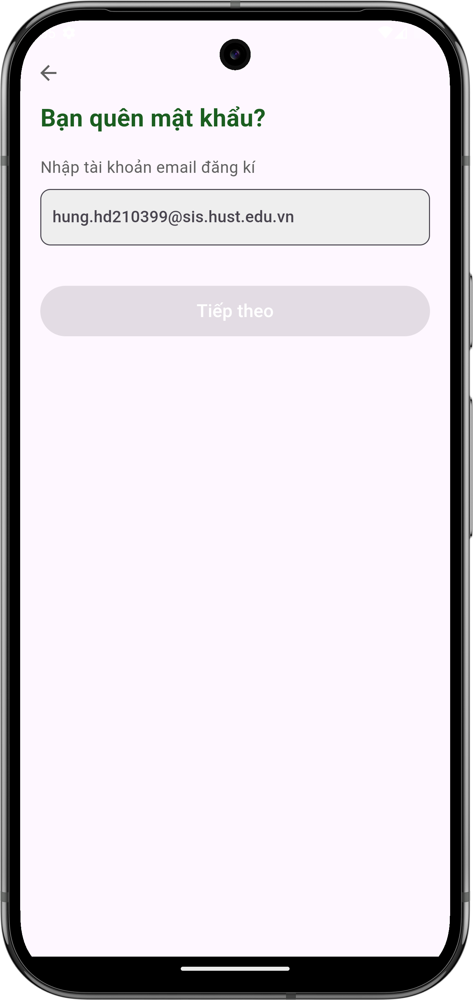
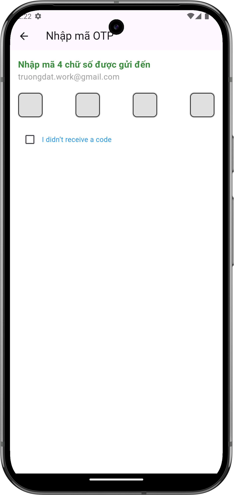
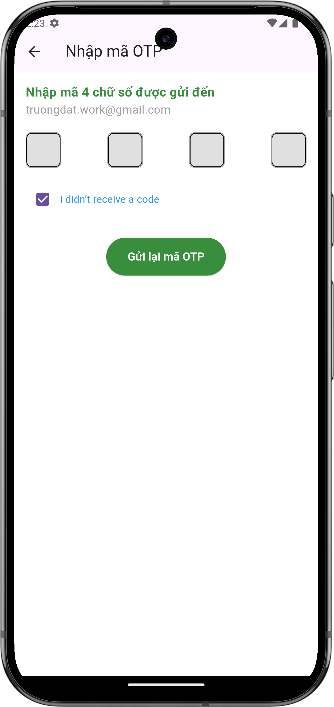

# Quên mật khẩu

## Giới thiệu
Nếu bạn quên mật khẩu tài khoản của mình, đừng lo lắng. Ứng dụng Đi Chợ Tiện Lợi cung cấp quy trình đơn giản để đặt lại mật khẩu thông qua email của bạn.

## Các bước đặt lại mật khẩu

### 1. Truy cập màn hình quên mật khẩu
- Tại màn hình đăng nhập, nhấn vào liên kết "Quên mật khẩu?"
- Màn hình đặt lại mật khẩu sẽ hiện ra

{ width="300" }

*Màn hình nhập email để đặt lại mật khẩu*

### 2. Nhập địa chỉ email
- Nhập địa chỉ email bạn đã dùng để đăng ký tài khoản
- Nhấn nút "Tiếp theo" để nhận mã xác thực

### 3. Xác thực mã OTP

{ width="300" }

*Màn hình nhập mã xác thực OTP*

- Kiểm tra hộp thư email của bạn để lấy mã xác thực 4 chữ số
- Nhập mã xác thực vào 4 ô trống
- Nếu không nhận được mã, bạn có thể:
  - Đánh dấu vào "I didn't receive a code"
  - Nhấn "Gửi lại mã OTP" để nhận mã mới

{ width="300" }

*Màn hình sau khi đã nhập mã OTP*

### 4. Nhập mật khẩu mới
- Sau khi xác thực thành công, bạn sẽ được gửi mật khẩu mới thông qua email.
- Bạn sẽ được chuyển tới màn hình đăng nhập và có thể đăng nhập bằng mật khẩu mới.

## Các lưu ý quan trọng

### Về mã OTP
- Mã OTP chỉ có hiệu lực trong thời gian 10 phút
- Mỗi email chỉ có thể yêu cầu gửi lại mã OTP một số lần nhất định trong một khoảng thời gian
- Đảm bảo kiểm tra cả thư mục spam nếu không thấy email chứa mã OTP

## Cần hỗ trợ thêm?

- Liên hệ với chúng tôi qua mục ["Liên hệ & Hỗ trợ"](../../support.md)
