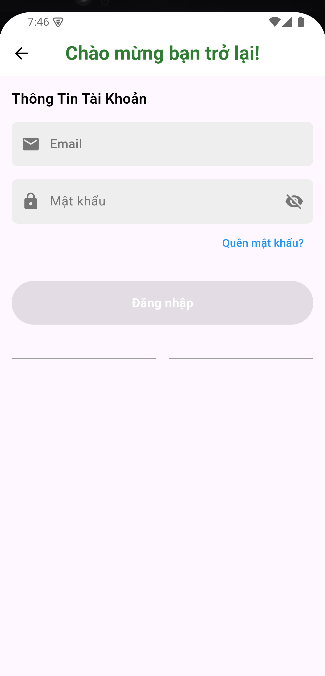

# Đăng nhập

## Giới thiệu
Để sử dụng đầy đủ tính năng của ứng dụng Go Shopping, bạn cần đăng nhập vào tài khoản của mình. Hướng dẫn này sẽ chỉ cho bạn cách đăng nhập vào ứng dụng.

## Các bước đăng nhập

### 1. Mở ứng dụng
{ width="48" }

- Tìm và nhấn vào biểu tượng Go Shopping trên điện thoại của bạn để mở ứng dụng
- Nếu bạn chưa đăng nhập, màn hình đăng nhập sẽ hiện ra

{ width="300" }

*Màn hình đăng nhập của ứng dụng Go Shopping*

### 2. Nhập thông tin đăng nhập

*Điền email/số điện thoại và mật khẩu vào các ô tương ứng*

- Nhập email hoặc số điện thoại của bạn vào ô "Email/Số điện thoại"
- Nhập mật khẩu vào ô "Mật khẩu"
- Bạn có thể nhấn vào biểu tượng 👁️ để hiện/ẩn mật khẩu

### 3. Xác nhận đăng nhập

*Nhấn nút "Đăng nhập" màu xanh để tiến hành đăng nhập*

- Nhấn nút "Đăng nhập" để tiến hành đăng nhập
- Nếu thông tin chính xác, bạn sẽ được chuyển đến [màn hình chính chứa thông tin danh sách group](../group/home.md) mà bạn đã tham gia của ứng dụng
- Nếu có lỗi, hệ thống sẽ hiển thị thông báo lỗi tương ứng

## Các tính năng bổ sung

### Ghi nhớ đăng nhập

Hệ thống sẽ tự động đăng nhập lại vào tài khoản nếu bạn mới đăng nhập trong vòng 7 ngày gần đây.

## Xử lý sự cố

### Các lỗi thường gặp
1. **Sai email/số điện thoại hoặc mật khẩu**
   
   *Lỗi đăng nhập sai: Thông báo khi nhập sai thông tin đăng nhập*
   - Kiểm tra lại thông tin đăng nhập
   - Đảm bảo Caps Lock không được bật
   - Thử [đặt lại mật khẩu](forgot-password.md) nếu không thể đăng nhập

### Cần hỗ trợ thêm?

- Liên hệ với chúng tôi qua mục ["Liên hệ & Hỗ trợ"](../../support.md)

