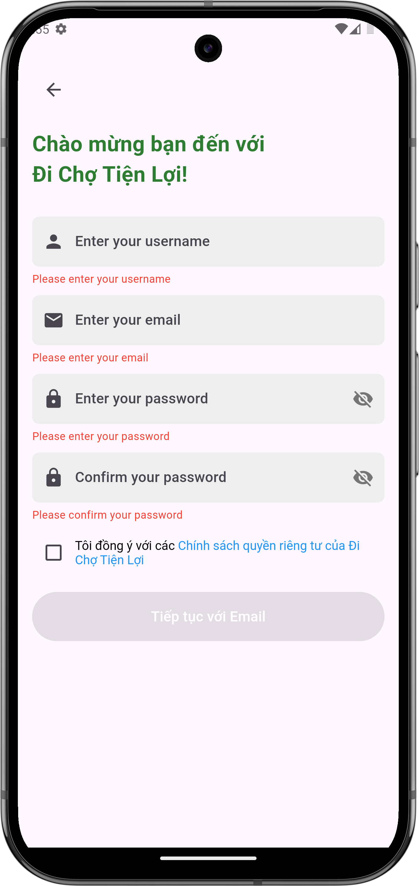

# Đăng ký

## Giới thiệu
Để bắt đầu sử dụng ứng dụng Đi Chợ Tiện Lợi, bạn cần tạo một tài khoản mới. Hướng dẫn này sẽ chỉ cho bạn cách đăng ký tài khoản trên ứng dụng.

## Các bước đăng ký

### 1. Mở ứng dụng và chọn đăng ký
{ width="48" }

- Tìm và nhấn vào biểu tượng Đi Chợ Tiện Lợi trên điện thoại của bạn để mở ứng dụng
- Nếu bạn chưa có tài khoản, chọn tùy chọn đăng ký

{ width="300" }

*Màn hình đăng ký của ứng dụng Đi Chợ Tiện Lợi*

### 2. Điền thông tin đăng ký

*Điền đầy đủ thông tin vào các trường yêu cầu:*

- Nhập tên người dùng vào ô "Enter your username"
- Nhập địa chỉ email vào ô "Enter your email"
- Tạo mật khẩu và nhập vào ô "Enter your password"
- Xác nhận lại mật khẩu trong ô "Confirm your password"
- Bạn có thể nhấn vào biểu tượng 👁️ để hiện/ẩn mật khẩu

### 3. Đồng ý với điều khoản

- Đọc và đánh dấu vào ô "Tôi đồng ý với các Chính sách quyền riêng tư của Đi Chợ Tiện Lợi"
- Việc đồng ý với điều khoản là bắt buộc để tiếp tục quá trình đăng ký

### 4. Hoàn tất đăng ký

- Nhấn nút "Tiếp tục với Email" để hoàn tất quá trình đăng ký
- Nếu thông tin hợp lệ, tài khoản của bạn sẽ được tạo và bạn sẽ được chuyển đến [màn hình chính](../group/home.md)

## Các lưu ý quan trọng

### Yêu cầu về mật khẩu
- Mật khẩu phải đủ mạnh để bảo vệ tài khoản của bạn
- Nên sử dụng kết hợp chữ hoa, chữ thường, số và ký tự đặc biệt

## Cần hỗ trợ thêm?

- Liên hệ với chúng tôi qua mục ["Liên hệ & Hỗ trợ"](../../support.md)
