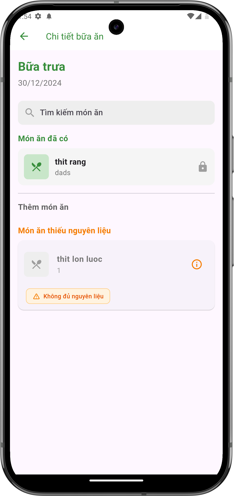
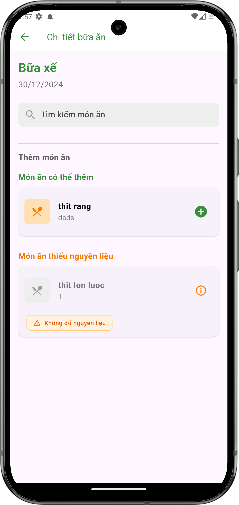

# Lập kế hoạch bữa ăn

## Giới thiệu
Tính năng lập kế hoạch bữa ăn giúp bạn quản lý và sắp xếp các món ăn cho từng bữa trong ngày. Bạn có thể thêm, xóa và kiểm tra nguyên liệu cho các món ăn.

## Các bước thực hiện

### 1. Truy cập chỉnh sửa bữa ăn
- Từ màn hình kế hoạch nấu ăn
- Nhấn vào biểu tượng bút chì bên phải bữa ăn muốn chỉnh sửa
- Màn hình chi tiết bữa ăn sẽ hiển thị

### 2. Nội dung hiển thị
- Tên bữa ăn và ngày
- Thanh tìm kiếm món ăn
- Danh sách món ăn được chia thành các phần:
    - Món ăn đã có: các món đã được thêm vào bữa ăn
    - Thêm món ăn: phần để thêm món ăn mới
    - Món ăn thiếu nguyên liệu: các món không đủ nguyên liệu để nấu

{ width="300" }

*Màn hình chi tiết bữa ăn*

### 3. Quản lý món ăn

#### Thêm món ăn
- Sử dụng thanh tìm kiếm để tìm món ăn muốn thêm
- Nhấn nút "+" bên phải món ăn để thêm vào bữa ăn
- Món ăn sẽ xuất hiện trong phần "Món ăn đã có"

#### Xóa món ăn
- Trong phần "Món ăn đã có"
- Nhấn vào biểu tượng khóa bên phải món ăn để xóa
- Xác nhận xóa khi được hỏi

{ width="300" }

*Màn hình quản lý món ăn trong bữa ăn*

## Tính năng bổ sung

### Kiểm tra nguyên liệu
- Hệ thống tự động kiểm tra số lượng nguyên liệu hiện có
- Hiển thị cảnh báo "Không đủ nguyên liệu" cho các món thiếu nguyên liệu
- Món ăn thiếu nguyên liệu được liệt kê riêng để dễ theo dõi

## Lưu ý
- Kiểm tra kỹ số lượng nguyên liệu trước khi thêm món ăn
- Cập nhật kế hoạch kịp thời khi có thay đổi
- Chỉ người có quyền mới có thể chỉnh sửa kế hoạch bữa ăn
- Nên cân đối món ăn giữa các bữa trong ngày 