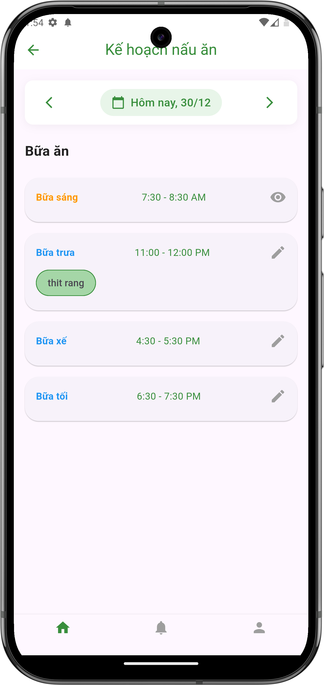

# Xem kế hoạch nấu ăn

## Giới thiệu
Tính năng xem kế hoạch nấu ăn giúp bạn theo dõi các bữa ăn trong ngày và các món ăn được lên kế hoạch cho từng bữa.

## Cách xem kế hoạch

### 1. Truy cập kế hoạch nấu ăn
- Từ trang chủ nhóm
- Nhấn vào mục "Kế hoạch nấu ăn"
- Màn hình sẽ hiển thị kế hoạch của ngày hiện tại

### 2. Nội dung hiển thị
- Ngày tháng (có thể chuyển đổi qua lại giữa các ngày)
- Danh sách các bữa ăn trong ngày:
    - Bữa sáng (7:30 - 8:30 AM)
    - Bữa trưa (11:00 - 12:00 PM)
    - Bữa xế (4:30 - 5:30 PM)
    - Bữa tối (6:30 - 7:30 PM)
- Mỗi bữa ăn hiển thị:
    - Tên bữa ăn
    - Thời gian
    - Các món ăn đã lên kế hoạch
    - Nút chỉnh sửa (biểu tượng bút chì)
    - Nút xem chi tiết (biểu tượng mắt)

{ width="300" }

*Màn hình danh sách kế hoạch bữa ăn*

## Tính năng chính

### Điều hướng ngày
- Sử dụng nút mũi tên trái/phải để chuyển đổi giữa các ngày
- Ngày hiện tại được hiển thị ở giữa (Ví dụ: "Hôm nay, 30/12")

### Xem chi tiết bữa ăn
- Nhấn vào biểu tượng mắt bên phải bữa ăn
- Xem được chi tiết các món ăn và nguyên liệu cần chuẩn bị

### Chỉnh sửa bữa ăn
- Nhấn vào biểu tượng bút chì bên phải bữa ăn
- Có thể thêm/xóa món ăn cho bữa ăn đó

## Lưu ý
- Kế hoạch nấu ăn được hiển thị theo ngày
- Mỗi bữa ăn có khung giờ cố định
- Có thể xem trước và lên kế hoạch cho những ngày tiếp theo
- Chỉ người có quyền mới có thể chỉnh sửa kế hoạch 