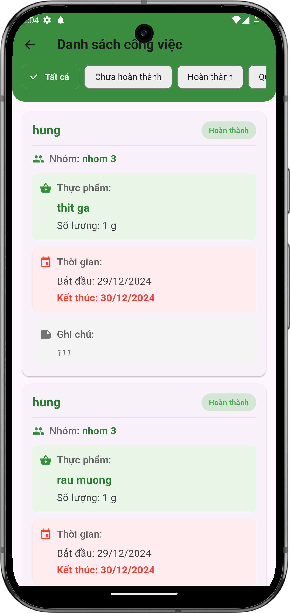
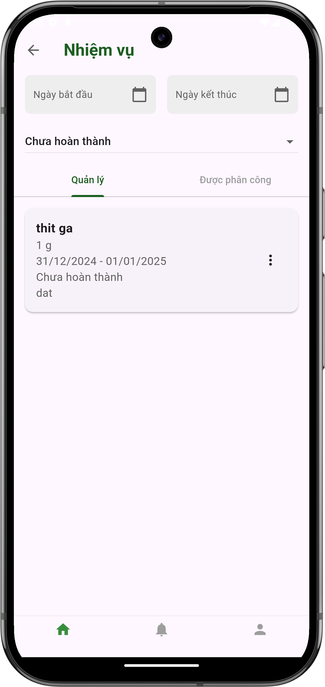
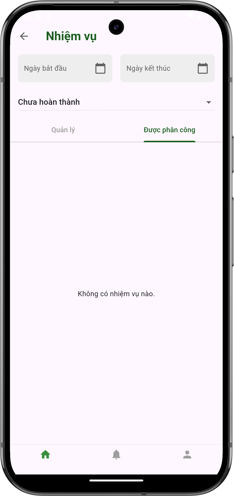

# Danh sách nhiệm vụ

## Giới thiệu
Tính năng danh sách nhiệm vụ giúp bạn theo dõi và quản lý các công việc được giao trong nhóm. Bạn có thể xem danh sách nhiệm vụ theo hai cách: từ trang cá nhân hoặc từ trang nhóm.

## Cách xem danh sách nhiệm vụ

### 1. Từ trang thông tin cá nhân
- Vào trang thông tin cá nhân
- Nhấn vào mục "Danh sách công việc"
- Màn hình sẽ hiển thị danh sách các nhiệm vụ được giao cho bạn
- Mỗi nhiệm vụ hiển thị:
    - Tên người được giao
    - Tên nhóm
    - Thực phẩm cần mua và số lượng
    - Thời gian bắt đầu và kết thúc
    - Ghi chú (nếu có)
    - Trạng thái hoàn thành

{ width="300" }

*Màn hình danh sách nhiệm vụ từ trang cá nhân*

### 2. Từ trang chủ nhóm
- Vào trang chủ nhóm
- Nhấn vào mục "Phân công"
- Màn hình sẽ hiển thị:
    - Bộ lọc theo ngày bắt đầu và kết thúc
    - Tab chuyển đổi giữa "Quản lý" và "Được phân công"
    - Danh sách nhiệm vụ theo bộ lọc đã chọn

{ width="300" }

*Màn hình danh sách nhiệm vụ từ trang nhóm*

## Tính năng chính

### Lọc nhiệm vụ
- Lọc theo trạng thái:
    - Tất cả
    - Chưa hoàn thành
    - Hoàn thành
    - Quá hạn
- Lọc theo thời gian:
    - Chọn ngày bắt đầu
    - Chọn ngày kết thúc

### Quản lý nhiệm vụ
- Xem chi tiết nhiệm vụ
- Cập nhật trạng thái hoàn thành
- Chỉnh sửa thông tin nhiệm vụ (đối với người tạo)
- Xóa nhiệm vụ (đối với người tạo)

### Thao tác với nhiệm vụ

#### 1. Xem chi tiết nhiệm vụ
- Nhấn vào thẻ nhiệm vụ để xem chi tiết
- Màn hình chi tiết hiển thị:
    - Tên người được giao
    - Thực phẩm và số lượng cần mua
    - Thời gian bắt đầu và kết thúc
    - Ghi chú (nếu có)
    - Trạng thái nhiệm vụ

{ width="300" }

*Màn hình chi tiết nhiệm vụ*

#### 2. Cập nhật trạng thái
- Từ màn hình chi tiết nhiệm vụ
- Nhấn vào nút tròn bên phải nhiệm vụ
- Trạng thái sẽ chuyển từ "Chưa hoàn thành" sang "Hoàn thành" hoặc ngược lại

#### 3. Chỉnh sửa nhiệm vụ
- Từ màn hình chi tiết, nhấn vào biểu tượng ba chấm (⋮)
- Chọn "Chỉnh sửa" từ menu
- Có thể chỉnh sửa:
    - Thực phẩm và số lượng
    - Thời gian bắt đầu và kết thúc
    - Ghi chú
- Nhấn "Cập nhật" để lưu thay đổi

#### 4. Xóa nhiệm vụ
- Nhấn vào biểu tượng ba chấm (⋮) trên thẻ nhiệm vụ
- Chọn "Xóa nhiệm vụ" từ menu
- Xác nhận xóa khi được hỏi

## Lưu ý
- Chỉ người tạo nhiệm vụ mới có quyền chỉnh sửa hoặc xóa
- Người được giao nhiệm vụ có thể cập nhật trạng thái hoàn thành
- Nên kiểm tra kỹ thông tin và thời hạn trước khi tạo nhiệm vụ
- Cập nhật trạng thái ngay khi hoàn thành nhiệm vụ 