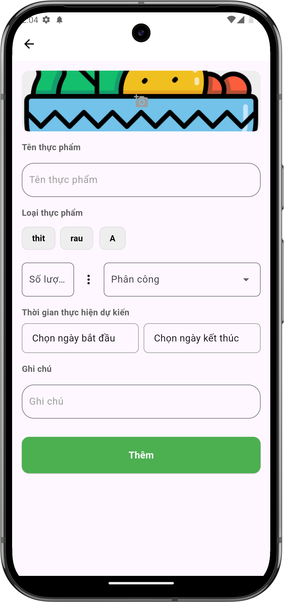

# Giao nhiệm vụ mua đồ mới

## Giới thiệu
Tính năng giao nhiệm vụ mua đồ mới giúp bạn phân công thành viên trong nhóm mua thực phẩm chưa có trong danh sách.

## Các bước thực hiện

### 1. Tạo nhiệm vụ mới
- Nhấn nút "+" để tạo nhiệm vụ mới
- Điền các thông tin:
    - Tên thực phẩm cần mua
    - Chọn loại thực phẩm (thịt/rau/...)
    - Nhập số lượng và đơn vị
    - Chọn người được phân công
    - Chọn thời gian thực hiện (ngày bắt đầu và kết thúc)
    - Thêm ghi chú (nếu cần)
- Nhấn "Thêm" để hoàn tất

{ width="300" }

*Màn hình giao nhiệm vụ mua đồ mới*

## Lưu ý
- Đặt tên thực phẩm rõ ràng, dễ hiểu
- Chọn đúng loại thực phẩm để dễ quản lý
- Ghi rõ số lượng và đơn vị đo
- Đặt thời gian thực hiện hợp lý
- Thêm ghi chú chi tiết nếu cần thiết (ví dụ: nơi mua, giá tham khảo) 