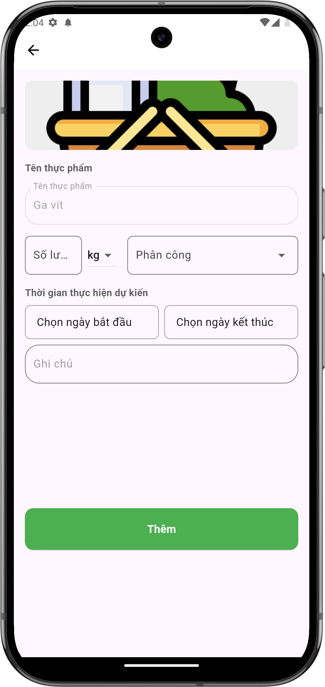

# Giao nhiệm vụ mua đồ cũ

## Giới thiệu
Tính năng giao nhiệm vụ mua đồ cũ giúp bạn phân công thành viên trong nhóm mua thêm thực phẩm đã có sẵn trong danh sách.

## Các bước thực hiện

### 1. Tạo nhiệm vụ mua thêm
- Chọn thực phẩm cần mua thêm từ danh sách có sẵn
- Điền các thông tin:
    - Nhập số lượng cần mua thêm và đơn vị
    - Chọn người được phân công
    - Chọn thời gian thực hiện (ngày bắt đầu và kết thúc)
    - Thêm ghi chú (nếu cần)
- Nhấn "Thêm" để hoàn tất

{ width="300" }

*Màn hình giao nhiệm vụ mua đồ cũ*

## Lưu ý
- Kiểm tra kỹ số lượng hiện có trước khi tạo nhiệm vụ
- Đặt số lượng cần mua thêm phù hợp
- Đặt thời gian thực hiện hợp lý
- Thêm ghi chú về yêu cầu đặc biệt nếu có (ví dụ: mua cùng thương hiệu, chất lượng) 