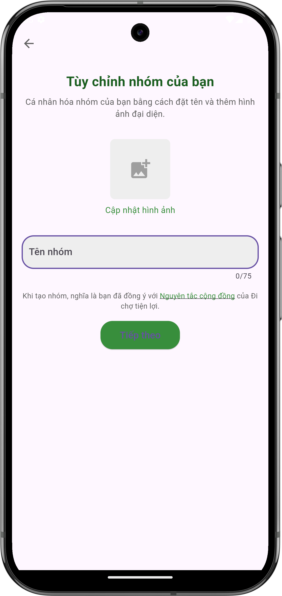
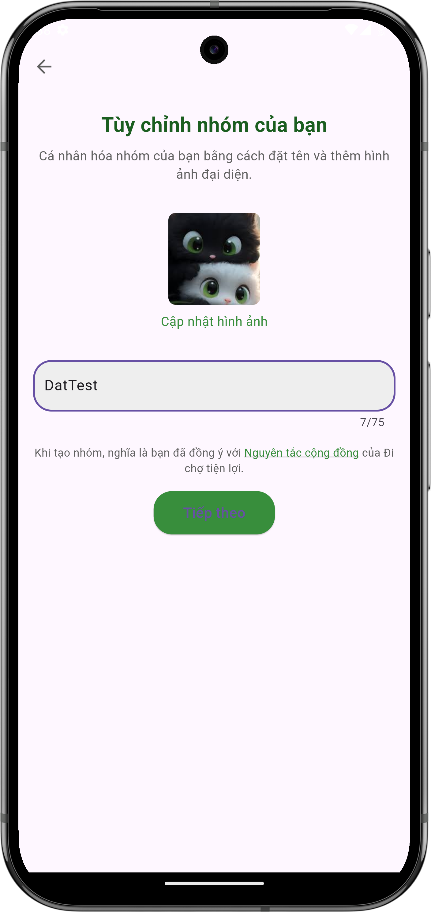

# Tạo nhóm mới

## Giới thiệu
Tạo nhóm mới giúp bạn tổ chức và quản lý việc mua sắm, ăn uống cùng với những người khác. Khi tạo nhóm, bạn sẽ trở thành trưởng nhóm và có thể mời thêm thành viên tham gia.

## Các bước tạo nhóm

### 1. Truy cập màn hình tạo nhóm
- Từ [màn hình danh sách nhóm](home.md), nhấn vào nút "+" ở góc phải dưới
- Màn hình tạo nhóm mới sẽ hiện ra

{ width="300" }

*Màn hình tạo nhóm mới*

### 2. Nhập thông tin nhóm
- Tùy chỉnh ảnh đại diện nhóm:
  - Nhấn vào biểu tượng "Cập nhật hình ảnh"
  - Chọn ảnh từ thư viện hoặc chụp ảnh mới
- Nhập tên nhóm vào ô "Tên nhóm"
  - Giới hạn 75 ký tự
  - Nên đặt tên dễ nhớ và mô tả được mục đích của nhóm

{ width="300" }

*Màn hình sau khi đã điền thông tin nhóm*

### 3. Xác nhận tạo nhóm
- Đọc và đồng ý với "Nguyên tắc cộng đồng"
- Nhấn "Tiếp theo" để chuyển đến bước thêm thành viên

### 4. Thêm thành viên
- Sau khi tạo nhóm, bạn sẽ được chuyển đến màn hình thêm thành viên
- [Xem hướng dẫn chi tiết về thêm thành viên](add-member.md)

## Lưu ý quan trọng

### Về tên nhóm
- Không sử dụng từ ngữ không phù hợp
- Tránh trùng lặp với tên nhóm đã có
- Nên đặt tên có ý nghĩa để dễ dàng quản lý

### Về ảnh đại diện
- Hỗ trợ các định dạng phổ biến (JPG, PNG)
- Kích thước file không quá 5MB
- Nên chọn ảnh có ý nghĩa liên quan đến mục đích của nhóm

### Về quyền trưởng nhóm
Sau khi tạo nhóm, bạn sẽ có các quyền:

- Thêm/xóa thành viên
- Quản lý hoạt động nhóm
- Xem thống kê chi tiết
- Xóa nhóm nếu cần

## Cần hỗ trợ thêm?

- Liên hệ với chúng tôi qua mục ["Liên hệ & Hỗ trợ"](../../support.md)
