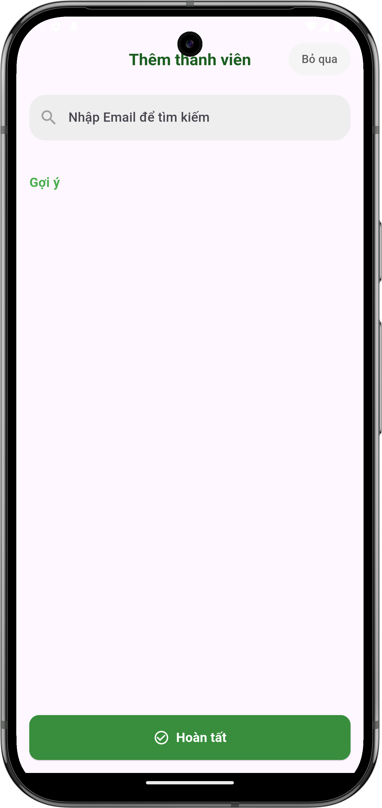
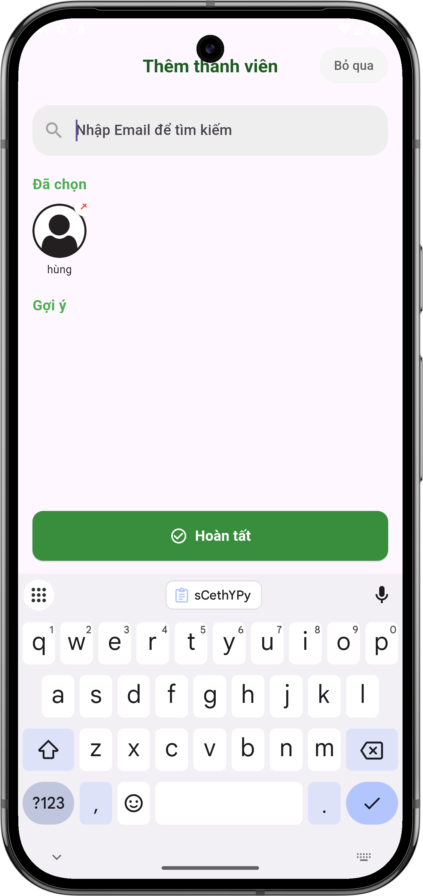

# Thêm thành viên vào nhóm

## Giới thiệu
Sau khi tạo nhóm, bạn có thể thêm các thành viên khác vào nhóm để cùng quản lý và theo dõi các hoạt động mua sắm, ăn uống.

## Các bước thêm thành viên

### 1. Truy cập màn hình thêm thành viên
- Sau khi tạo nhóm mới, bạn sẽ được tự động chuyển đến màn hình thêm thành viên
- Hoặc từ màn hình nhóm, nhấn vào biểu tượng thêm thành viên ở góc phải trên

{ width="300" }

*Màn hình thêm thành viên vào nhóm*

### 2. Tìm kiếm thành viên
- Nhập email của người dùng vào ô tìm kiếm
- Kết quả tìm kiếm sẽ hiển thị các tài khoản phù hợp

{ width="300" }

*Màn hình sau khi đã chọn thành viên*

### 3. Quản lý danh sách thành viên đã chọn
- Các thành viên đã chọn sẽ hiển thị trong mục "Đã chọn"
- Để xóa thành viên khỏi danh sách:
  - Nhấn vào dấu "×" bên cạnh tên thành viên
  - Thành viên đó sẽ bị xóa khỏi danh sách đã chọn

### 4. Hoàn tất thêm thành viên
- Nhấn "Hoàn tất" để xác nhận thêm các thành viên đã chọn
- Bạn sẽ được chuyển đến màn hình chính của nhóm
- Hoặc nhấn "Bỏ qua" nếu chưa muốn thêm thành viên

## Lưu ý quan trọng

### Về tìm kiếm thành viên
- Chỉ có thể thêm người dùng đã đăng ký tài khoản
- Email phải chính xác để tìm kiếm thành công
- Có thể thêm nhiều thành viên cùng lúc
- Không thêm được thành viên đã tham gia nhóm

### Về quyền hạn
- Chỉ trưởng nhóm mới có quyền thêm thành viên mới
- Thành viên mới sẽ có các quyền cơ bản trong nhóm
- Có thể thêm thành viên bất cứ lúc nào sau khi tạo nhóm

## Cần hỗ trợ thêm?

- Liên hệ với chúng tôi qua mục ["Liên hệ & Hỗ trợ"](../../support.md)
