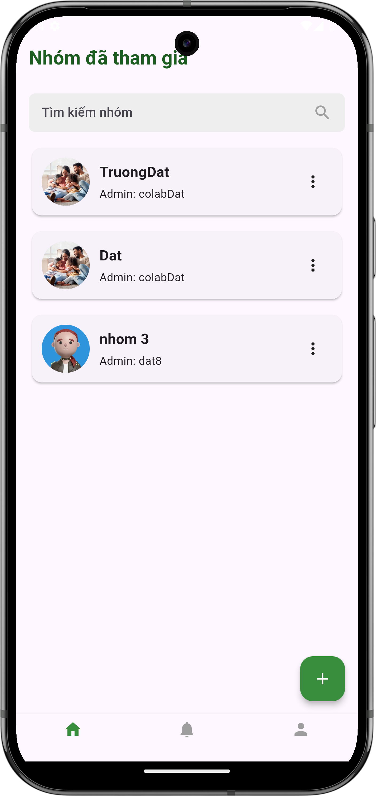
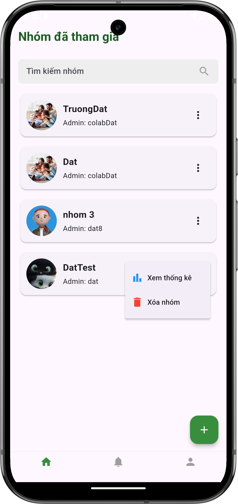
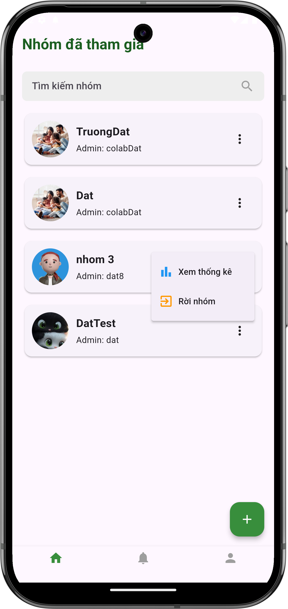

# Danh sách nhóm

## Giới thiệu
Màn hình danh sách nhóm là nơi bạn có thể xem và quản lý tất cả các nhóm mà bạn đã tham gia. Từ đây, bạn có thể thực hiện nhiều thao tác như tạo nhóm mới, xem thống kê, hoặc rời nhóm.

## Xem danh sách nhóm

### 1. Truy cập màn hình danh sách
- Đây là màn hình chính của ứng dụng
- Hiển thị tất cả các nhóm bạn đã tham gia
- Mỗi nhóm hiển thị:

    - Tên nhóm
    - Ảnh đại diện của nhóm
    - Tên người quản trị (Admin)

{ width="300" }

*Màn hình danh sách nhóm đã tham gia*

## Các chức năng chính

### 1. Tạo nhóm mới
- Nhấn vào nút "+" ở góc phải dưới màn hình
- [Xem hướng dẫn chi tiết về tạo nhóm mới](add-group.md)

### 2. Quản lý nhóm
Với mỗi nhóm, nhấn vào biểu tượng ba chấm (⋮) để hiện menu tùy chọn:

#### Đối với trưởng nhóm
- Xem thống kê: Xem báo cáo chi tiết về mua sắm và ăn uống
- Xóa nhóm: Xóa hoàn toàn nhóm và tất cả dữ liệu liên quan

{ width="300" }

*Menu tùy chọn dành cho trưởng nhóm*

#### Đối với thành viên
- Xem thống kê: Xem báo cáo chi tiết về mua sắm và ăn uống
- Rời nhóm: Thoát khỏi nhóm hiện tại

{ width="300" }

*Menu tùy chọn dành cho thành viên nhóm*

## Lưu ý quan trọng

### Về quyền hạn trong nhóm
- Trưởng nhóm có quyền:
    - Xem thống kê
    - Xóa nhóm
    - Quản lý thành viên
- Thành viên có quyền:
    - Xem thống kê
    - Rời nhóm

### Về xóa và rời nhóm
- Xóa nhóm: 
    - Chỉ trưởng nhóm mới có quyền này
    - Hành động không thể hoàn tác
    - Tất cả dữ liệu nhóm sẽ bị xóa
- Rời nhóm:
    - Áp dụng cho thành viên thường
    - Có thể xin tham gia lại nếu muốn

## Cần hỗ trợ thêm?

- Liên hệ với chúng tôi qua mục ["Liên hệ & Hỗ trợ"](../../support.md)
