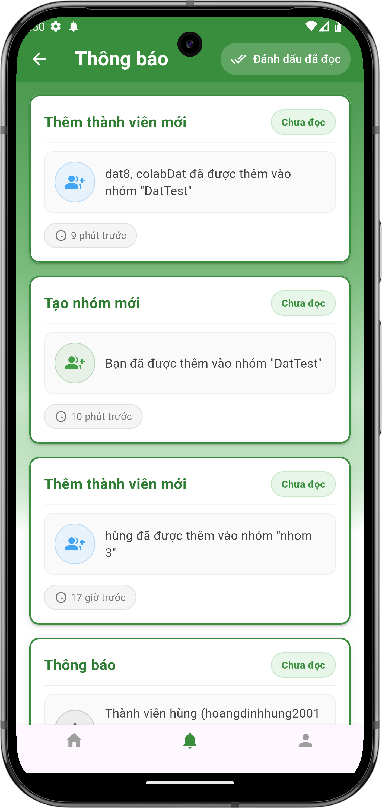
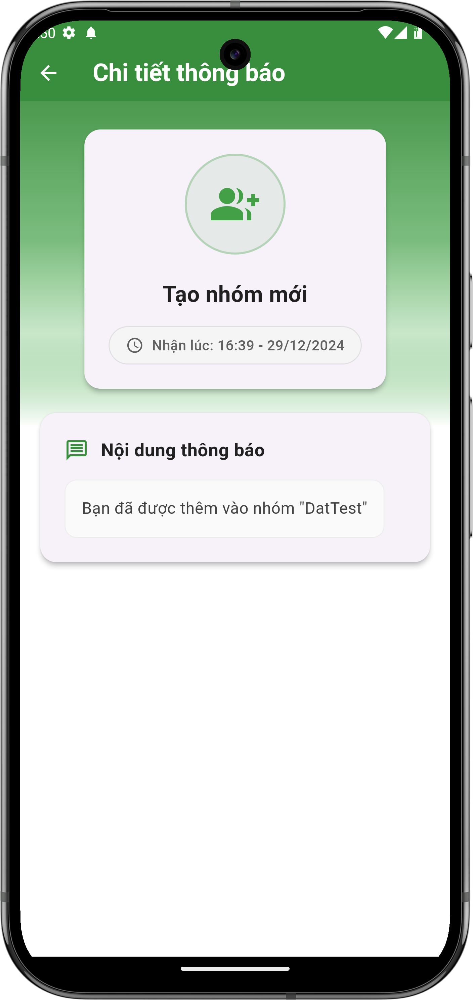
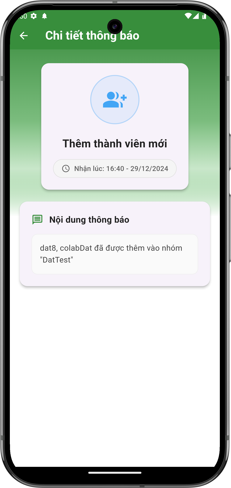
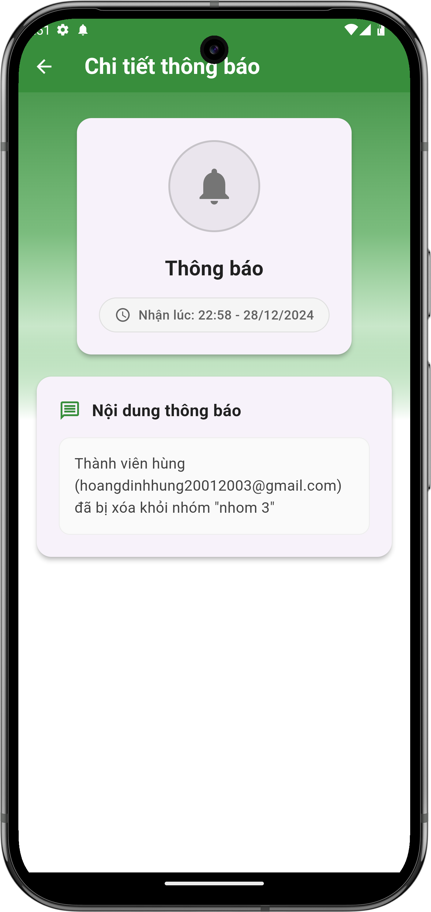
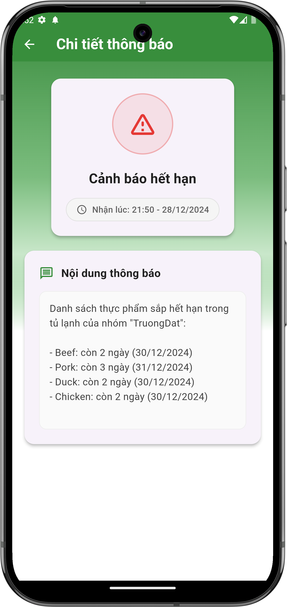
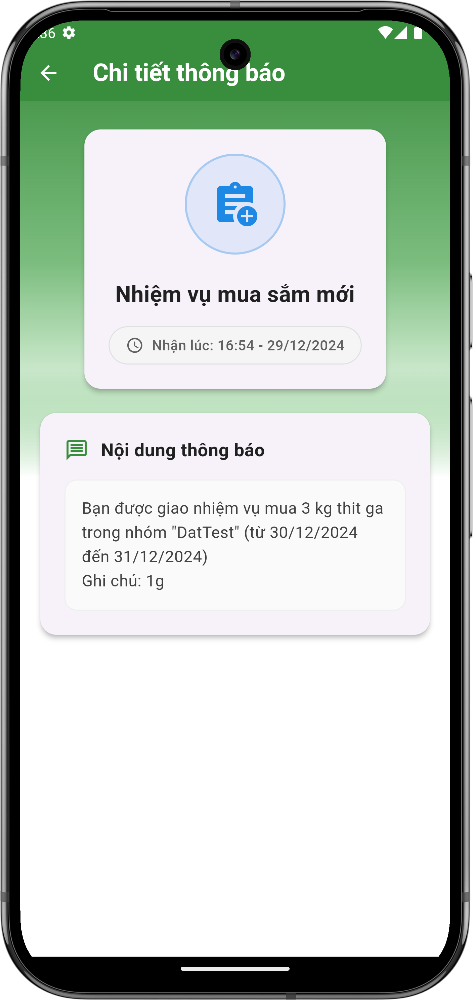

# Xem danh sách thông báo

## Giới thiệu
Màn hình danh sách thông báo là nơi bạn có thể xem tất cả các thông báo từ hệ thống và các nhóm. Tại đây, bạn có thể theo dõi các cập nhật về hoạt động nhóm, thành viên mới và các thông báo khác.

## Các tính năng chính

### 1. Xem danh sách thông báo
- Từ màn hình chính, nhấn vào biểu tượng chuông 🔔 trên thanh điều hướng phía dưới
- Màn hình sẽ hiển thị danh sách tất cả thông báo của bạn
- Mỗi thông báo hiển thị:
    - Tiêu đề thông báo
    - Nội dung chi tiết
    - Thời gian nhận thông báo
    - Trạng thái đã đọc/chưa đọc

{ width="300" }

*Màn hình danh sách thông báo*

### 2. Đánh dấu đã đọc
- Nhấn vào nút "Đánh dấu đã đọc" ở góc phải trên cùng để đánh dấu tất cả thông báo là đã đọc
- Thông báo chưa đọc sẽ có nhãn "Chưa đọc" màu xanh lá
- Thông báo đã đọc sẽ không có nhãn đặc biệt

## Chi tiết các loại thông báo

### 1. Xem chi tiết thông báo
Khi nhấn vào một thông báo, màn hình chi tiết sẽ hiển thị:
- Biểu tượng tương ứng với loại thông báo
- Tiêu đề thông báo
- Thời gian nhận thông báo
- Nội dung chi tiết của thông báo

| Tạo nhóm mới | Thêm thành viên | Xóa thành viên | Cảnh báo hết hạn | Nhiệm vụ mua sắm |
|:---:|:---:|:---:|:---:|:---:|
| { width="150" } | { width="150" } | { width="150" } | { width="150" } | { width="150" } |

*Các loại màn hình chi tiết thông báo*

### 2. Thông báo về nhóm

#### Tạo nhóm mới
- Biểu tượng: Người dùng với dấu cộng màu xanh lá
- Tiêu đề: "Tạo nhóm mới"
- Nội dung: Thông báo khi bạn được thêm vào nhóm mới

#### Thêm thành viên
- Biểu tượng: Người dùng với dấu cộng màu xanh dương
- Tiêu đề: "Thêm thành viên mới"
- Nội dung: Thông báo khi có thành viên mới được thêm vào nhóm

#### Xóa thành viên
- Biểu tượng: Chuông thông báo màu xám
- Tiêu đề: "Thông báo"
- Nội dung: Thông báo khi một thành viên bị xóa khỏi nhóm

### 3. Thông báo cảnh báo hết hạn
- Biểu tượng: Dấu chấm than trong tam giác màu đỏ
- Tiêu đề: "Cảnh báo hết hạn"
- Nội dung: Danh sách các thực phẩm sắp hết hạn, bao gồm:
    - Tên thực phẩm
    - Số ngày còn lại
    - Ngày hết hạn

### 4. Thông báo nhiệm vụ mua sắm
- Biểu tượng: Clipboard với dấu cộng màu xanh dương
- Tiêu đề: "Nhiệm vụ mua sắm mới"
- Nội dung: Chi tiết nhiệm vụ được giao, bao gồm:
    - Tên nhóm giao nhiệm vụ
    - Số lượng và loại thực phẩm cần mua
    - Thời gian thực hiện (từ ngày - đến ngày)
    - Ghi chú bổ sung (nếu có)

## Lưu ý quan trọng
- Thông báo sẽ được lưu trữ và có thể xem lại bất cứ lúc nào
- Thời gian nhận thông báo được hiển thị bên dưới mỗi thông báo
- Bạn nên thường xuyên kiểm tra thông báo để không bỏ lỡ thông tin quan trọng

## Cần hỗ trợ thêm?
- Liên hệ với chúng tôi qua mục ["Liên hệ & Hỗ trợ"](../../support.md)
