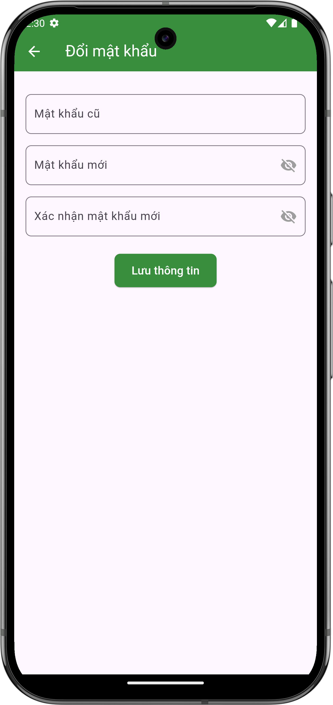

# Đổi mật khẩu

## Giới thiệu
Để bảo mật tài khoản, bạn nên thay đổi mật khẩu định kỳ hoặc khi nghi ngờ mật khẩu bị lộ.

## Các bước đổi mật khẩu

### 1. Truy cập trang đổi mật khẩu
- Từ [trang thông tin cá nhân](view.md), nhấn vào "Đổi mật khẩu"
- Màn hình đổi mật khẩu sẽ hiện ra

{ width="300" }

*Màn hình đổi mật khẩu*

### 2. Nhập thông tin mật khẩu
Điền đầy đủ các trường:

- Mật khẩu cũ
- Mật khẩu mới
- Xác nhận mật khẩu mới

### 3. Hoàn tất thay đổi
- Nhấn "Lưu thông tin" để xác nhận thay đổi
- Nếu thông tin chính xác, mật khẩu mới sẽ được cập nhật

## Lưu ý quan trọng

### Yêu cầu mật khẩu mới
- Mật khẩu mới phải khác mật khẩu cũ
- Đề xuất tuân thủ các yêu cầu về độ mạnh của mật khẩu:
  - Kết hợp chữ hoa, chữ thường
  - Bao gồm số và ký tự đặc biệt
  - Độ dài tối thiểu 8 ký tự

### Bảo mật
- Không chia sẻ mật khẩu với người khác
- Nên sử dụng mật khẩu khác với các tài khoản khác
- Đổi mật khẩu ngay khi nghi ngờ bị lộ

## Cần hỗ trợ thêm?

- Liên hệ với chúng tôi qua mục ["Liên hệ & Hỗ trợ"](../../support.md) 