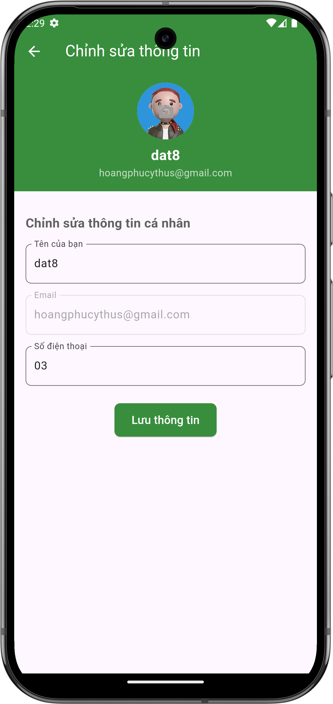

# Chỉnh sửa thông tin cá nhân

## Giới thiệu
Bạn có thể dễ dàng cập nhật thông tin cá nhân của mình như tên người dùng, số điện thoại và ảnh đại diện.

## Các bước chỉnh sửa

### 1. Truy cập trang chỉnh sửa
- Từ [trang thông tin cá nhân](view.md), nhấn vào "Chỉnh sửa thông tin cá nhân"
- Màn hình chỉnh sửa sẽ hiện ra

{ width="300" }

*Màn hình chỉnh sửa thông tin cá nhân*

### 2. Cập nhật thông tin
Bạn có thể chỉnh sửa các thông tin sau:

- Tên của bạn
- Số điện thoại
- Ảnh đại diện

### 3. Lưu thay đổi
- Sau khi cập nhật thông tin, nhấn "Lưu thông tin" để hoàn tất
- Hệ thống sẽ lưu các thay đổi và quay lại trang thông tin cá nhân

## Lưu ý quan trọng

### Về thông tin có thể chỉnh sửa
- Email không thể thay đổi sau khi đã đăng ký
- Đảm bảo số điện thoại chính xác để nhận thông báo quan trọng

### Về ảnh đại diện
- Hỗ trợ các định dạng ảnh phổ biến (JPG, PNG)
- Kích thước ảnh nên nhỏ hơn 5MB

## Cần hỗ trợ thêm?

- Liên hệ với chúng tôi qua mục ["Liên hệ & Hỗ trợ"](../../support.md)
