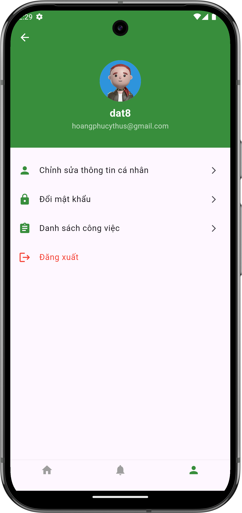

# Xem thông tin cá nhân

## Giới thiệu
Từ màn hình chính, bạn có thể dễ dàng xem thông tin cá nhân của mình bằng cách truy cập vào trang cá nhân.

## Các bước xem thông tin

### 1. Truy cập trang cá nhân
- Từ màn hình chính, nhấn vào biểu tượng người dùng ở thanh điều hướng phía dưới
- Màn hình thông tin cá nhân sẽ hiện ra, hiển thị:
    - Ảnh đại diện
    - Tên người dùng
    - Email

{ width="300" }

*Màn hình thông tin cá nhân*

### 2. Các tùy chọn có sẵn
Từ màn hình thông tin cá nhân, bạn có thể:
- [Chỉnh sửa thông tin cá nhân](edit.md)
- [Đổi mật khẩu](change-password.md)
- Đăng xuất khỏi tài khoản

## Cần hỗ trợ thêm?

- Liên hệ với chúng tôi qua mục ["Liên hệ & Hỗ trợ"](../../support.md)
