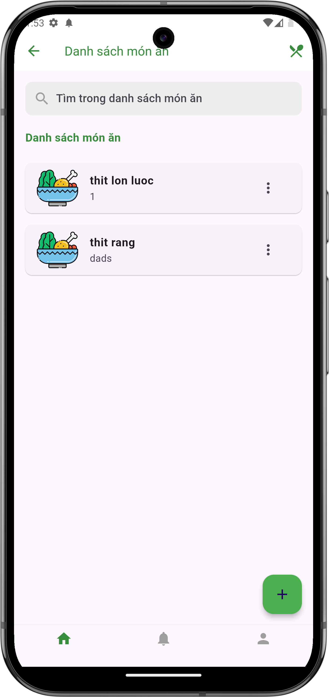
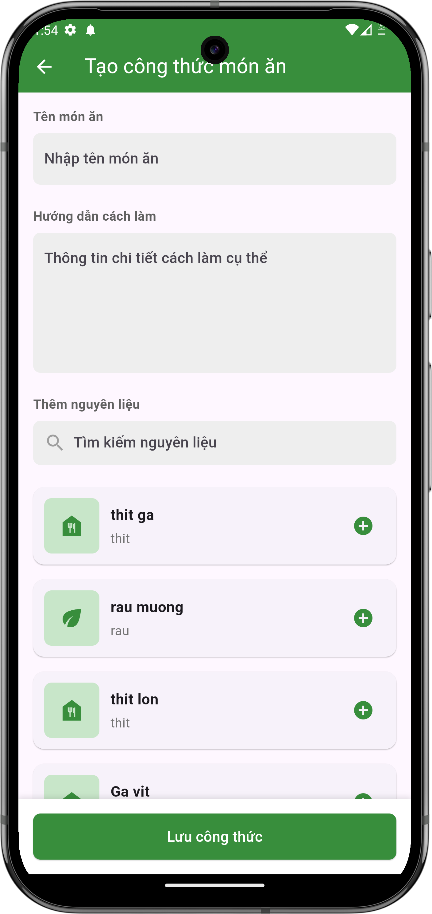
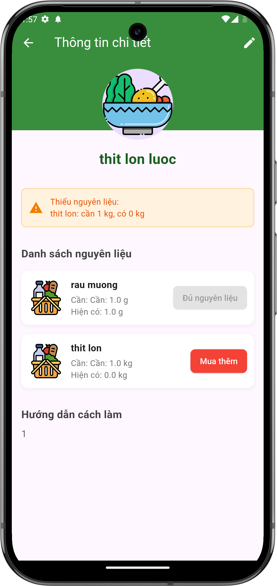
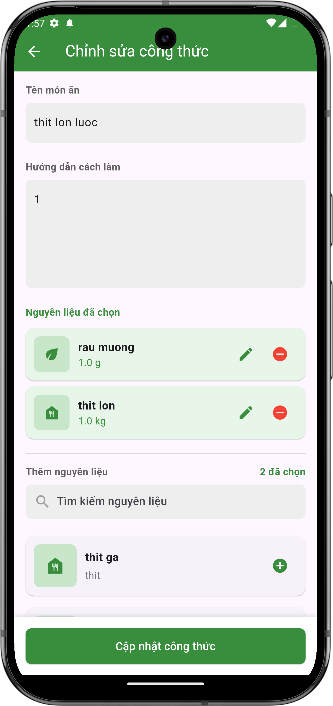
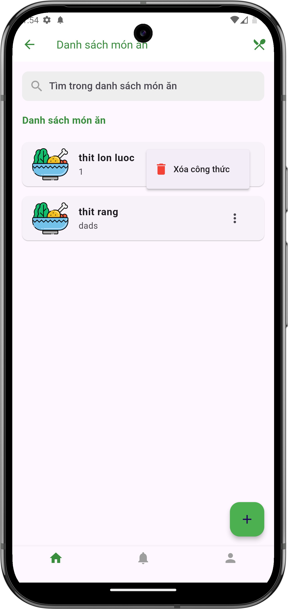

# Quản lý công thức nấu ăn

## Giới thiệu
Tính năng quản lý công thức nấu ăn giúp bạn lưu trữ và chia sẻ các món ăn trong nhóm. Bạn có thể thêm mới, chỉnh sửa, xem chi tiết hoặc xóa các công thức.

## Danh sách công thức

### Màn hình danh sách
- Hiển thị tất cả công thức nấu ăn trong nhóm
- Mỗi công thức được hiển thị dưới dạng thẻ với:
    - Biểu tượng món ăn
    - Tên món ăn
    - Ghi chú (nếu có)
- Có thanh tìm kiếm để lọc công thức theo tên

{ width="300" }

*Màn hình danh sách công thức nấu ăn*

## Thao tác với công thức

### 1. Thêm công thức mới
- Nhấn nút "+" ở góc phải dưới màn hình
- Điền thông tin công thức:
    - Tên món ăn
    - Hướng dẫn cách làm chi tiết
    - Thêm nguyên liệu cần thiết và số lượng
- Nhấn "Lưu công thức" để hoàn tất

{ width="300" }

*Màn hình thêm công thức mới*

### 2. Xem chi tiết công thức
- Nhấn vào thẻ công thức để xem chi tiết
- Màn hình chi tiết hiển thị:
    - Tên món ăn
    - Danh sách nguyên liệu với số lượng cần thiết
    - Số lượng hiện có của mỗi nguyên liệu
    - Hướng dẫn cách làm
    - Cảnh báo nguyên liệu thiếu (nếu có)

{ width="300" }

*Màn hình chi tiết công thức*

### 3. Chỉnh sửa công thức
- Từ màn hình chi tiết, nhấn nút chỉnh sửa (biểu tượng bút chì)
- Có thể chỉnh sửa:
    - Tên món ăn
    - Hướng dẫn cách làm
    - Thêm/xóa/sửa nguyên liệu và số lượng
- Nhấn "Cập nhật công thức" để lưu thay đổi

{ width="300" }

*Màn hình chỉnh sửa công thức*

### 4. Xóa công thức
- Nhấn vào biểu tượng ba chấm (⋮) trên thẻ công thức
- Chọn "Xóa công thức" từ menu
- Xác nhận xóa khi được hỏi

{ width="300" }

*Menu xóa công thức*

## Lưu ý
- Đặt tên món ăn rõ ràng, dễ hiểu
- Ghi chi tiết số lượng nguyên liệu cần thiết
- Viết hướng dẫn cách làm theo từng bước
- Kiểm tra kỹ số lượng nguyên liệu hiện có trước khi nấu