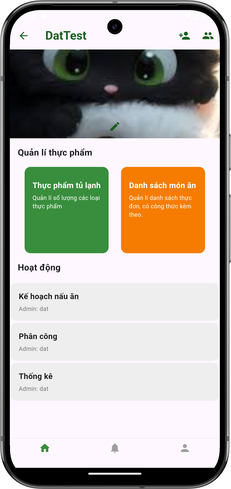
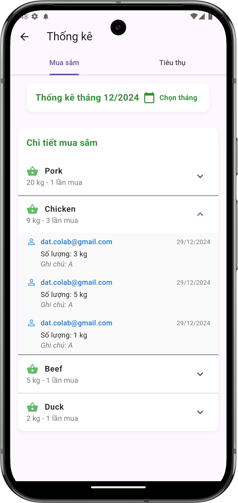
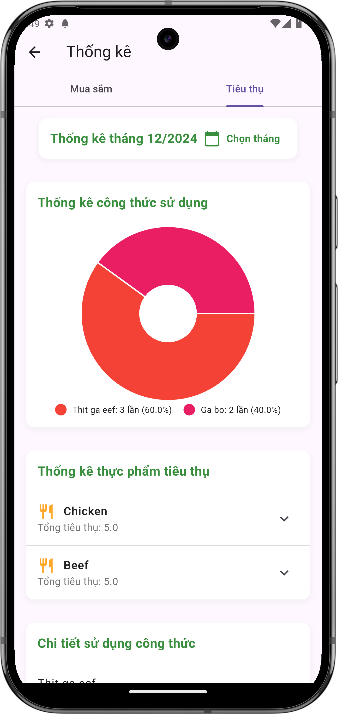

# Xem thống kê

## Giới thiệu
Tính năng thống kê giúp bạn theo dõi hoạt động mua sắm và tiêu thụ thực phẩm trong nhóm. Bạn có thể xem chi tiết về số lượng, tần suất mua sắm và mức độ sử dụng các công thức nấu ăn.

## Cách truy cập thống kê

### 1. Từ màn hình danh sách nhóm
- Nhấn vào biểu tượng ba chấm (⋮) bên cạnh tên nhóm
- Chọn "Xem thống kê" từ menu tùy chọn

{ width="300" }

*Màn hình danh sách nhóm*

### 2. Từ màn hình chi tiết nhóm
- Vào chi tiết nhóm
- Nhấn vào mục "Thống kê" trong danh sách các tính năng

{ width="300" }

*Màn hình chi tiết nhóm*

## Các loại thống kê

### 1. Thống kê mua sắm
- Chọn tab "Mua sắm"
- Hiển thị thông tin:
    - Thời gian thống kê (tháng/năm)
    - Chi tiết mua sắm theo từng loại thực phẩm:
        - Tên thực phẩm
        - Tổng số lượng đã mua
        - Số lần mua
    - Chi tiết từng lần mua:
        - Email người mua
        - Số lượng
        - Ngày mua
        - Ghi chú

{ width="300" }

*Màn hình thống kê mua sắm*

### 2. Thống kê tiêu thụ
- Chọn tab "Tiêu thụ"
- Hiển thị thông tin:
    - Biểu đồ thống kê công thức sử dụng:
        - Tỷ lệ sử dụng từng công thức
        - Số lần sử dụng
    - Danh sách thực phẩm đã tiêu thụ:
        - Tên thực phẩm
        - Tổng số lượng đã sử dụng

{ width="300" }

*Màn hình thống kê tiêu thụ*

## Tính năng bổ sung
- Chọn tháng: Nhấn vào nút "Chọn tháng" để xem thống kê của tháng khác
- Xem chi tiết: Nhấn vào mũi tên (∨) bên cạnh mỗi mục để xem thông tin chi tiết

## Lưu ý
- Thống kê được cập nhật theo thời gian thực
- Dữ liệu thống kê được lưu trữ và có thể xem lại bất cứ lúc nào
- Chỉ thành viên trong nhóm mới có quyền xem thống kê 